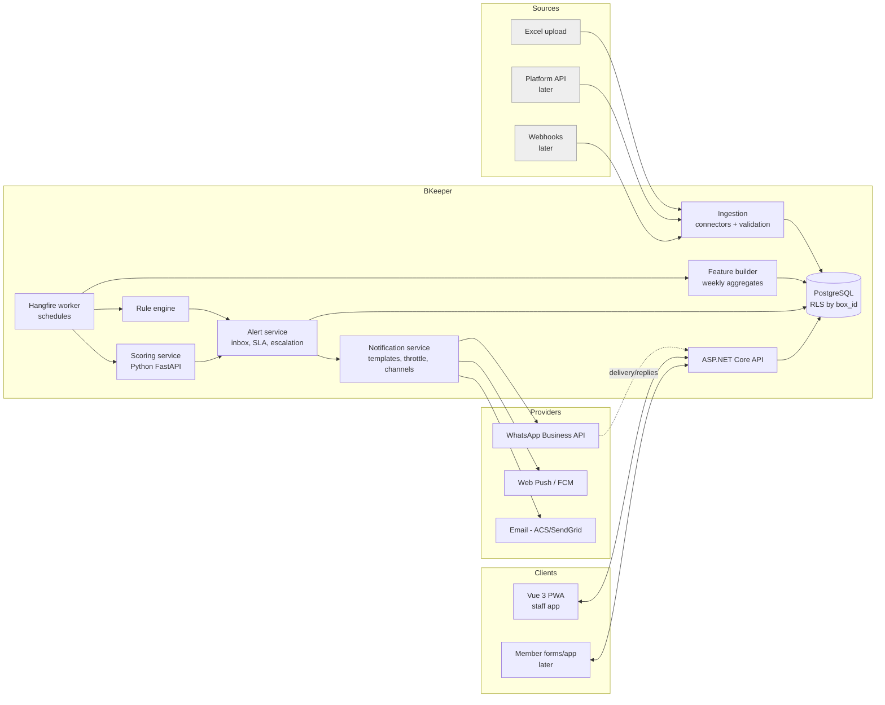
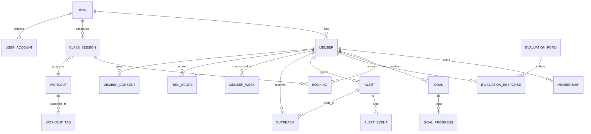
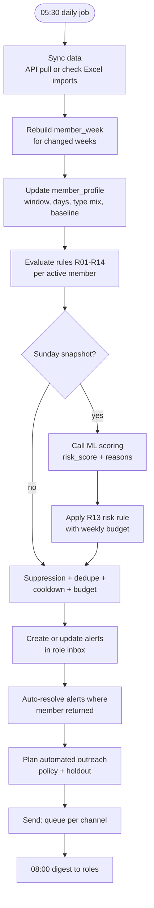
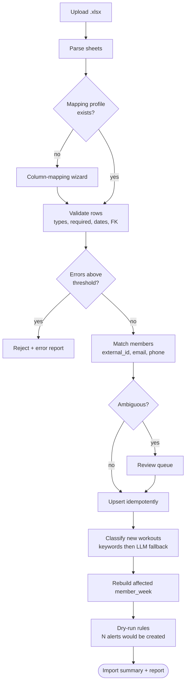
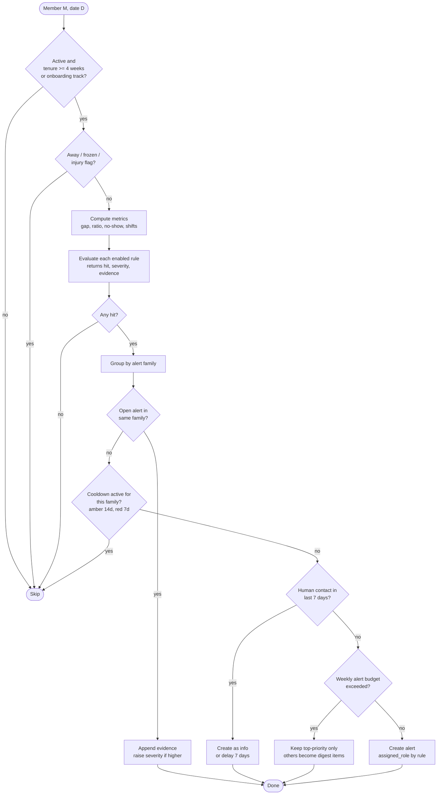
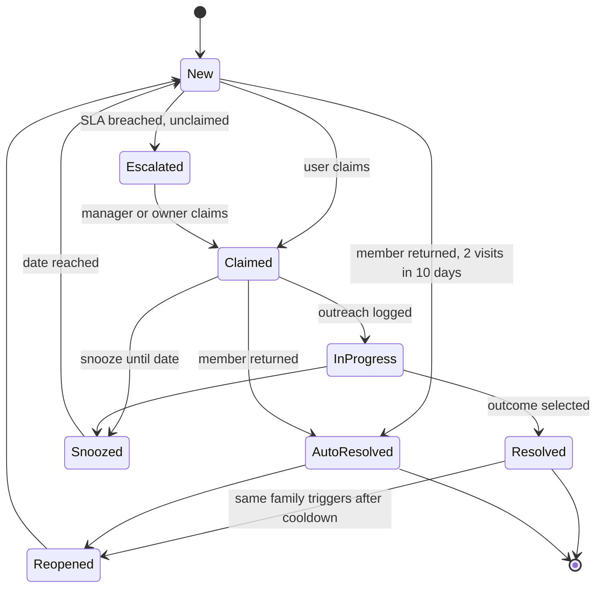
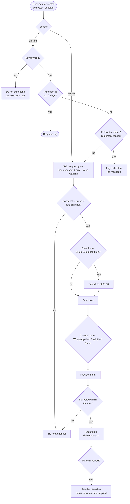
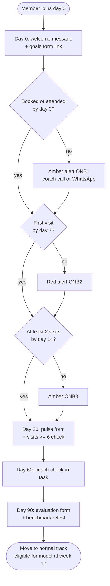
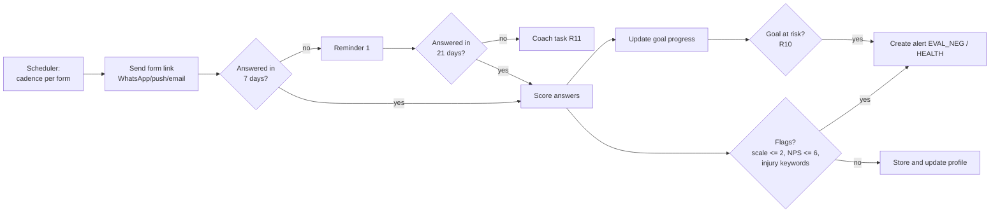
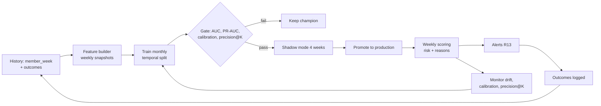

# BKeeper — Retention Platform for CrossFit Boxes
### Implementation plan for an AI coding agent (week-structured)

> **Version:** 1.0 · **Owner:** Filipe · **Target:** MVP in 8 weeks, production pilot in 12 weeks
> **Companion files:** `bkeeper_prototype.py` (sample-data generator + prediction prototype), `bkeeper_sample_data.xlsx` (import test file, 25 % churn scenario)

---

## 0. How the agent must use this document

1. **Work one week at a time.** Each week has *Goals → Tasks → Deliverables → Acceptance tests*. A week is done only when every acceptance test passes in CI.
2. **Tests first** for all rule logic, import logic and scoring logic (see §12). Rules are pure functions over data → trivially testable.
3. **Never invent business rules.** Every threshold in this document is a *default* stored in configuration (DB table `rule_config`, per box). If something is ambiguous, add it to `docs/OPEN_QUESTIONS.md` and continue with the documented default.
4. **Multi-tenant from the first migration.** Every table has `box_id`. No query without a `box_id` filter (enforced by EF Core global filter + Postgres Row Level Security).
5. **Sample data only in dev/test.** Never seed sample data into a production database. Real PII never goes into logs, tests, or prompts.
6. **Small commits, one PR per task group,** update `docs/DECISIONS.md` (ADR log) whenever a decision in §2 changes.
7. **Prompt template per week:**
   > "Read `docs/PLAN.md`. Implement **Week N** only. Follow §0 rules. Start by writing the acceptance tests listed for the week, then implement until green. At the end, list what you did, what you skipped, and any new open questions."

---

## 1. Product vision and scope

**Vision:** BKeeper turns raw box data (members, classes, bookings, workouts) into **timely human actions** that keep members training. It is not a reporting tool — it is an *action engine*: detect → prioritise → notify → follow up → learn.

**Loop:** `Data in → Signals → Alerts (role inbox) → Outreach (auto + coach) → Outcome recorded → Model & rules improve`

### In scope (MVP → v1)
- Excel import (now) and API connector (later) with idempotent ingestion
- Member timeline, workout-type profile, time-window fingerprint
- Rule-based alerts (absence, no booking, frequency drop, no-shows, window shift, workout-type shift, onboarding, milestones, goals, evaluations)
- Churn-risk prediction with explanations (shadow mode first)
- Role-based alert inbox with claim / SLA / escalation / outcomes
- Notifications: WhatsApp, push, email; automatic standard messages + coach personal messages
- Member goals and recurring evaluation forms
- Dashboards: retention, cohorts, alert operations, workout mix

### Out of scope (for now)
Payments/billing, class booking UI for members, programming (WOD editor), public marketing site.

### Roles
| Role | Can do |
|---|---|
| **Owner** | Everything, incl. rule config, exports, users, integrations |
| **Manager** | Alert inbox (all), escalations, templates, evaluations config, dashboards |
| **Coach** | Alert inbox (coach-level alerts), member profiles, send messages, log outcomes, goals/evaluations |
| **Reception** (optional) | Read members, log outcomes for onboarding/membership alerts |
| **Member** (v1+) | Answer forms, see own goals, receive push |

---

## 2. Key decisions (ADR summary)

| # | Decision | Why |
|---|---|---|
| D1 | **Modular monolith** in .NET (API + Worker) + Vue 3 SPA/PWA + PostgreSQL | Your stack; simple ops; split later if needed |
| D2 | **Python ML service** (FastAPI, scikit-learn/LightGBM/SHAP), called by the Worker in batch | Prototype already in Python; best ML tooling; isolated |
| D3 | **Rules first, model in shadow, then blended** | 500 members ≈ 4–10 churners/month → little data; rules give value on day 1, model needs validation on real history |
| D4 | **Alerts belong to a role inbox, never to one person** | Avoids lost alerts (your requirement). "Primary coach" is a *hint* only |
| D5 | **Canonical data model + connector interface**; Excel is connector #1 | API can be added without touching rules/UI |
| D6 | **Rules are data (config), not code** | Per-box tuning, A/B testing, no redeploys |
| D7 | **Automated messages only for low/medium severity; red alerts go to a human first** | Protects relationships; measurable via holdout |
| D8 | **Every alert and message has a recorded outcome** | Only way to learn what works |
| D9 | Time zone = box time zone (default `Europe/Lisbon`); default language `pt-PT`, `en` supported | Quiet hours, "week" boundaries, templates |
| D10 | Week = Monday–Sunday; evaluation snapshot = Sunday 23:30 box time; daily rule run = 05:30 | Deterministic, testable |

---

## 3. Architecture



**Tech stack:** .NET 8+ (Minimal API or controllers, EF Core, FluentValidation, MediatR-lite), Hangfire (Postgres storage), PostgreSQL 16, Vue 3 + Vite + TypeScript + Pinia + Vue Router + PrimeVue (or your UI kit) as **PWA**, Python 3.12 + FastAPI + scikit-learn + LightGBM + SHAP + pandas, Docker, Azure (Container Apps, Postgres Flexible Server, Blob Storage, Key Vault, App Insights), Bicep for IaC, GitHub Actions CI.

**Repository layout**
```
bkeeper/
  docs/            PLAN.md, DECISIONS.md, OPEN_QUESTIONS.md, RUNBOOK.md
  src/
    BKeeper.Api/            HTTP endpoints, auth, webhooks
    BKeeper.Domain/         entities, value objects, rule contracts (no dependencies)
    BKeeper.Application/    use cases, rule engine, alert workflow, notification policy
    BKeeper.Infrastructure/ EF Core, connectors (Excel, API), providers (WhatsApp, Push, Email)
    BKeeper.Worker/         Hangfire jobs
    BKeeper.Tests.Unit/  BKeeper.Tests.Integration/
  web/             Vue 3 PWA
  ml/              features/, train/, serve/ (FastAPI), tests/, notebooks/
  data/sample/     generator (bkeeper_prototype.py) + sample xlsx
  infra/           bicep/, docker-compose.yml
```

---

## 4. Domain model



### Core tables (columns beyond `id`, `box_id`, `created_at`, `updated_at`)
| Table | Key columns |
|---|---|
| `member` | external_id, name, email, phone_e164, birth_year?, join_date, status (`active/frozen/cancelled/lapsed`), cancel_date, cancel_reason, language, primary_coach_id?, away_until?, injury_flag_until? |
| `membership` | member_id, plan_name, plan_freq_per_week?, start_date, end_date?, status, freeze_start?, freeze_end? |
| `class_session` | external_id, starts_at (tz-aware), class_type, coach_name, capacity, workout_id, `window` (early <08:00, morning 08–11, lunch 11–14, afternoon 14–17, evening ≥17) |
| `workout` | date, title, description, source (`import/api/manual`) |
| `workout_tag` | workout_id, tag (`strength/metcon/gymnastics/endurance/hybrid/skill/mobility`), weight 0–1, source (`rule/llm/manual`), confidence |
| `booking` | member_id, session_id, booked_at, status (`booked/attended/no_show/late_cancel/cancelled`), external_id |
| `member_week` | member_id, iso_week_start, visits, bookings, no_shows, late_cancels, visits_by_window (jsonb), visits_by_type (jsonb), first/last visit dates — **derived**, rebuilt idempotently |
| `member_profile` | member_id, usual_window, usual_days (jsonb), type_mix (jsonb), persona, median_gap_days, baseline_26w, updated_at — derived weekly |
| `alert` | member_id, family, rule_codes[], severity (`info/amber/red`), status, assigned_role, claimed_by?, due_at, snooze_until?, evidence (jsonb), outcome?, outcome_note?, resolved_at?, fingerprint |
| `alert_event` | alert_id, type (`created/claimed/escalated/snoozed/outreach/resolved/reopened/auto_resolved`), actor, payload |
| `outreach` | member_id, alert_id?, channel, template_key?, body, sent_by (`system/user`), status (`queued/sent/delivered/read/failed/replied`), provider_msg_id, is_holdout |
| `rule_config` | rule_code, enabled, params (jsonb), severity_map, cooldown_days, audience_role |
| `risk_score` | member_id, snapshot_week, model_version, p_churn_28d, band, top_reasons (jsonb) |
| `goal` / `goal_progress` | category, description, metric, baseline_value, target_value, unit, target_date, status; progress: date, value, source |
| `evaluation_form` / `evaluation_response` | form: key, version, schema (jsonb), cadence; response: member_id, answered_at, answers (jsonb), scores (jsonb), coach_id? |
| `member_consent` | member_id, channel, purpose, granted_at, revoked_at, evidence |
| `import_run` / `import_row_error` | source, file_name, mapping_profile, counts, status; row errors with sheet/row/message |

### Excel import template (v1)
**Sheet `Members`** — `member_id`* · `name`* · `email` · `phone` · `join_date`* · `plan` · `status`* (active/frozen/cancelled) · `cancel_date` · `cancel_reason`
**Sheet `Classes`** — `session_id`* · `date`* · `start_time`* · `class_type`* · `coach` · `capacity` · **`workout_title`** · **`workout_description`** *(the workout text; used for profile and tags)*
**Sheet `Attendance`** — `booking_id` · `member_id`* · `session_id`* · `status`* (attended/no_show/late_cancel/cancelled) · `booked_at`
*(Optional later: `Plans`, `Freezes`, `Goals`, `Benchmarks`.)*

Import rules:
- Idempotent by `(box_id, source, external_id)`; re-uploading updates, never duplicates.
- Column-mapping wizard; the mapping profile is saved per box.
- Validation report (downloadable) with sheet/row/message; import is **all-or-nothing per sheet** above a configurable error threshold (default 2 %), otherwise partial with report.
- Members matched by `external_id`, else by normalised email/phone; ambiguous matches go to a **review queue**.
- After import: recompute `member_week` for affected weeks only, then run the daily pipeline in *dry-run* mode and show "N alerts would be created".

---

## 5. Definitions (single source of truth)

| Term | Definition |
|---|---|
| **Visit** | Booking with status `attended` |
| **Active member** | status `active` (not frozen/cancelled) with membership valid on the date |
| **Churned** | Membership cancelled/expired without renewal (`cancel_date`) **or** *lapsed*: no visit for ≥ 45 days while status still `active` (configurable) |
| **Baseline rate** | Mean weekly visits over the last 26 weeks, ending 4 weeks ago, using only weeks after join (min 8 weeks) |
| **Usual window** | Mode of visit windows in weeks −16…−4 |
| **Type mix** | Distribution of visited workout types (weights from `workout_tag`) |
| **Median gap** | Median days between consecutive visits over last 12 weeks |
| **Eligible for model** | Tenure ≥ 12 weeks. Younger members follow the **Onboarding track** (rules) |
| **Risk label (ML)** | Member churns within 28 days after snapshot |
| **Away** | Member/coach flagged holiday or injury until a date → alerts suppressed until then |

---

## 6. Workflow schemas

### 6.1 Daily and weekly pipeline



### 6.2 Excel import



### 6.3 Rule evaluation for one member



**Priority score** (for sorting and budget): `severity_weight (red 100 / amber 60 / info 20) + risk_score×100 + tenure_bonus (long-tenure +10) + goal_at_risk +10 − recent_contact_penalty (−30)`.

### 6.4 Alert lifecycle and escalation



**SLA and escalation defaults**

| Severity | Inbox role | Claim SLA | Escalation 1 (→ Manager) | Escalation 2 (→ Owner) | Push/digest |
|---|---|---|---|---|---|
| red | Coach + Manager | 24 h | after 24 h unclaimed | after 48 h unclaimed | immediate push to role members + daily digest |
| amber | Coach | 72 h | after 72 h | after 7 days | daily digest |
| info | Coach | 7 days | none (auto-expire after 14 days) | none | weekly digest |

Escalation is done by a Hangfire job every 15 min: `WHERE status='New' AND due_at < now()` → set `assigned_role` to next level, log `escalated`, notify that role. **An alert can never be "owned" by an absent person**: `claimed_by` only shows who took it; if a claimed alert has no activity for 48 h (red) / 5 days (amber) it returns to `New` and is re-escalated.

**Outcome taxonomy** (mandatory to resolve; feeds analytics and the churn-reason model):
`returned` · `contacted_replied_will_return` · `contacted_no_reply` · `unreachable` · `schedule_change_needed` · `injury_or_health_pause` · `price_or_budget` · `moved_away` · `lost_motivation` · `coach_or_class_issue` · `cancelled_membership` · `false_positive_no_action` · `other`.

### 6.5 Notification routing



Notification rules: consent per channel and purpose; WhatsApp only with approved templates outside the 24 h reply window; opt-out keywords (`STOP`, `PARAR`) processed automatically; automatic messages max **1 per member per 7 days**; language from `member.language`; every message stores template key + rendered text + provider id.

### 6.6 Onboarding track (first 12 weeks)



### 6.7 Goals and evaluations



### 6.8 Prediction loop



---

## 7. Rule catalogue (defaults — all configurable per box)

**Alert families** (one open alert per member per family): `ATTENDANCE` (R01–R04, R13), `PATTERN` (R05–R07), `ONBOARDING` (R08), `GOAL` (R10), `EVAL` (R11), `MEMBERSHIP` (R12), `WINBACK` (R14), `POSITIVE` (R09).

| Code | Name | Trigger (default) | Severity | Audience | Automated message? |
|---|---|---|---|---|---|
| **R01** | Absence gap | `days_since_last_visit ≥ max(10, ceil(2.5 × median_gap))`, cap 30. Needs baseline ≥ 1 visit/week | amber at threshold; red at ≥ 1.5× threshold or ≥ 21 days | Coach → Manager | amber: yes ("we miss you"); red: no (coach) |
| **R02** | Not booking | No booking in next 7 days **and** days since last booking ≥ max(5, 1.5 × median booking gap); baseline ≥ 2/week | amber | Coach | yes (schedule nudge, suggests usual class) |
| **R03** | Frequency drop | last-2-week rate < 60 % of baseline for **2 consecutive weekly evaluations** (baseline ≥ 1.5/wk); red if < 30 % | amber / red | Coach | amber: yes |
| **R04** | No-show streak | ≥ 2 no-shows/late-cancels in 14 days **or** rate > 25 % over 8 weeks (min 6 bookings) | amber | Coach | no (coach; sensitive) |
| **R05** | Time-window shift | Share of visits in usual window dropped ≥ 40 pp over last 4 weeks (≥ 4 visits) | info; amber if with R03 | Coach | no; may suggest class offer |
| **R06** | Workout-type shift | Jensen-Shannon divergence ≥ 0.25 between last-6-week and prior-12-week type mix (≥ 8 visits each) | info | Coach | no |
| **R07** | Type abandonment | Type that was ≥ 30 % of visits in prior 12 weeks fell to 0 in last 6 weeks with ≥ 6 visits | info (aggregate report to Manager if ≥ 5 members: programming signal) | Coach/Manager | no |
| **R08** | Onboarding | see §6.6 (ONB1 amber, ONB2 red, ONB3 amber; day-30 visits < 6 amber) | as listed | Coach + Reception | welcome/nudges yes |
| **R09** | Milestone (positive) | 25/50/100/250/500 classes, anniversary, 12-week streak, PR logged | info | Coach | yes (celebration) |
| **R10** | Goal at risk | Goal due within 6 weeks and required pace not met, **or** no progress update for 8 weeks | amber | Coach | no |
| **R11** | Evaluation overdue | Form due > 7 days unanswered → reminder; > 21 days → coach task | info | Coach | reminder yes |
| **R12** | Membership event | Freeze ends in 7 days; plan expires in 14 days without renewal; payment failed (if data) | amber | Manager/Reception | renewal reminder yes |
| **R13** | Churn risk (ML) | `p_churn_28d ≥ 0.08` red, `0.03–0.08` amber; only top **K per week** (default `K = 2 % of active members`, ≈ 10) | red/amber | Coach + Manager | red: no; amber: no (human first) |
| **R14** | Win-back | Cancelled member at day 7 / 30 / 90 | info | Manager | day 30 & 90 yes (survey + offer) |

**Combination logic:** R01 + R03 (or R13) in the same run → single `ATTENDANCE` alert, severity = max, evidence lists all triggers. R05/R06 alone never go above `info`, but if `ATTENDANCE` alert exists they are attached as *context* ("moved from evening to lunch classes 3 weeks ago").

**Rule config example (YAML → stored as JSON in `rule_config.params`)**
```yaml
R01:
  enabled: true
  params: { min_days: 10, gap_multiplier: 2.5, cap_days: 30, red_multiplier: 1.5, red_days: 21, min_baseline_per_week: 1 }
  cooldown_days: { amber: 14, red: 7 }
  audience_role: Coach
  auto_message: { amber: MISS_YOU_SOFT, red: null }
R03:
  enabled: true
  params: { ratio_amber: 0.6, ratio_red: 0.3, consecutive_weeks: 2, min_baseline: 1.5, window_weeks: 2 }
R13:
  enabled: true
  params: { red_p: 0.08, amber_p: 0.03, weekly_budget_pct_active: 0.02, mode: shadow }   # shadow -> live
```

**Suppression list (applied to every rule):** member frozen/cancelled · `away_until`/`injury_flag_until` in future · human outreach in last 7 days (downgrade to info) · same-family open alert (merge) · cooldown · membership < 4 weeks (onboarding track only) · box holiday calendar (closed days do not count as gaps; August and Christmas weeks apply a **seasonal factor** of 0.8 / 0.6 to baselines — as in the prototype).

**Workout classification (feeds R05–R07, profile, model):**
1. Keyword rules on `workout_title + description` → tags with weights (e.g. `squat|deadlift|press|clean|snatch|1RM|5x5` → strength; `AMRAP|EMOM|for time|rounds` → metcon; `muscle-up|handstand|HSPU|ring|pull-up progression|skill` → gymnastics; `run|row|bike|ski|erg|[0-9]+ ?m` → endurance; `partner|team|hero` → hybrid).
2. If total confidence < 0.6 → LLM classification (Claude via API) returning JSON `{tag: weight}`; cached by text hash.
3. Manager can override; overrides win and are used as training labels for the classifier.
**Member persona** (weekly): any type with share ≥ 45 % → "Lifter / Metcon fan / Gymnast / Endurance"; else "Balanced". Persona is descriptive (coach context), not used to gate alerts.

---

## 8. Prediction specification

| Item | Spec |
|---|---|
| **Target** | `y = 1` if member cancels/lapses within 28 days after the weekly snapshot |
| **Snapshots** | Every Sunday for every eligible member (tenure ≥ 12 weeks, active, not away) |
| **Split** | Strict temporal: train weeks ≤ T, gap of 4 weeks, test after. Never random split (label overlaps 4 weeks) |
| **Features (16)** | tenure_w, plan_ord, visits_4w, base_rate_8w, ratio (4w vs 8w), slope_8w, zero_weeks_6, base_rate_26w, ratio_2w_26w, low_weeks_6, days_since_att, days_since_book, upcoming_7d, noshow_rate_8w, window_shift, type_shift. Later: goal_gap, last_eval_score, message_response, class_fill_context, payment_failed |
| **Models** | Logistic regression (standardised) + regularised gradient boosting (LightGBM: depth 3, ≥120 leaf samples, L2) → **average of probabilities** |
| **Explanations** | SHAP top-3 drivers, mapped to readable phrases via a whitelist (e.g. "last 2 weeks = 14 % of usual", "3 no-shows in 14 days"). Only show drivers pointing in the *risk* direction |
| **Calibration** | Check reliability by band monthly; isotonic calibration when ≥ 1,500 positives |
| **Cadence** | Score weekly; retrain monthly (or when drift alarm); versioned in `model_registry` |
| **Gates before live** | Real-data backtest: AUC ≥ 0.75, PR-AUC ≥ 5× base rate, top-10/week precision ≥ 2× rules-v1 precision at same volume; **4 weeks shadow** with weekly review |
| **Onboarding** | Members < 12 weeks: rules only (data too thin). Revisit with a second model when ≥ 150 early churn examples |
| **Non-attendance signals** | "Sudden" leavers are mostly invisible in attendance — add payment failures, price changes, coach changes, survey scores as soon as the API delivers them |

### Prototype results (synthetic data, 25 % churn scenario — **engineering validation, not proof**)
Generated with `bkeeper_prototype.py` (seed 42): 770 members over 104 weeks, 504 active at the end, 160,876 bookings, **realised annual churn 24.7 %**; churn behaviours: gradual fade 122, pattern-shift-then-leave 46, sudden 57, early dropout 41 (plus non-churn noise: holidays, injuries, August/Christmas dips).

| Metric (test = 27 later weeks, ~500 active) | Value |
|---|---|
| Positive rate (churn within 28 d) | 1.7 % of member-weeks |
| ROC-AUC — logistic / boosting / ensemble | 0.823 / 0.802 / 0.821 |
| PR-AUC ensemble (base rate 0.017) | 0.256 (≈ 15× base) |
| Lift in top 5 % of scores | 9.0× |

**Alert-budget simulation** (4-week cooldown per member; "recall" = churners flagged 2–8 weeks before leaving; 56 churners):

| Strategy | Alerts/week | Precision (leaves ≤ 28 d) | Recall with ≥ 2 weeks lead |
|---|---|---|---|
| Rules v1 only (R01 + R03 + zero-weeks) | 21.1 | 6.5 % | 46 % |
| Model top 5 / week | 5 | 20.7 % | 41 % |
| Model top 10 / week | 10 | 12.6 % | **50 %** |
| Model top 20 / week | 20 | 7.8 % | **62.5 %** |

Recall by behaviour (top 20/week vs rules): gradual 66 % vs 56 % · shift 92 % vs 58 % · **sudden 25 % vs 8 %**.
Calibration on test: predicted 0.6 % → actual 0.7 %; 2.8 % → 3.3 %; 5.6 % → 4.9 %; 10.9 % → 11.3 %; ≥ 15 % → 37 % (slightly under-confident at the top).
Onboarding rule (≤ 2 classes in first 21 days): flagged 21 members, precision 52 %, recall 38 % of early leavers.

**What this tells us**
1. The model matches the rules' coverage with **about half the alerts** (top-10 vs 21/week) or adds ~16 pp recall at similar volume → real, but modest. Rules + model together is the right design.
2. Precision is inherently low at 28-day horizon (most flagged members stay) → alerts must be **cheap to act on** (one-tap WhatsApp templates) and priority-ranked.
3. Some churners are invisible to attendance data (sudden leavers, ~25 %). That is a data problem, not a modelling problem.
4. Numbers will differ on real data. The **first real backtest (Week 8)** decides thresholds and the go-live gate.

---

## 9. Goals and evaluations specification

**Goal record:** `category` (strength · skill (e.g. muscle-up) · body composition · endurance · competition/event · health/rehab · consistency · social) · `description` · `metric` (e.g. "back squat 1RM", "attendance/week", "body weight") · `baseline_value` · `target_value` · `unit` · `target_date` · `status` (`active/achieved/paused/dropped`). Progress rows come from evaluations, benchmark retests, coach entries, or **automatic** (consistency goals computed from attendance).

**Capture moments:** onboarding form (day 0), quarterly review, coach can add/edit anytime; member can update via form link.

**Forms (versioned JSON schema; conditional questions supported):**
| Form | When | Content |
|---|---|---|
| `ONBOARDING` | day 0 | goals (multi-select + main goal), experience, injuries/limitations, preferred days/times, how did you find us, consent for channels |
| `PULSE_D30` | day 30 | satisfaction 1–5, "how welcome do you feel" 1–5, class time fit, one open text |
| `PULSE_D90` | day 90 | as above + NPS 0–10 + goal progress |
| `QUARTERLY` | every 8 weeks (configurable) | goal progress per active goal, energy/motivation 1–5, recovery/sleep 1–5, pain/injury (yes/no + text), coach & class satisfaction 1–5, NPS, "anything we should change" |
| `BENCHMARK` | every 12 weeks | measured values for chosen benchmarks (lifts, WOD times, run/row time) → progress rows |
| `EXIT` | on cancellation / win-back day 7 | reason taxonomy (same as outcomes), what would have kept you, NPS |

**Scoring and flags:** `engagement_index = mean(satisfaction, welcome, energy, coach)`; flags: any scale ≤ 2, NPS ≤ 6, pain = yes → alert `EVAL_NEG` (amber) or `HEALTH` (amber, Coach); free text passed through classifier (injury/price/schedule/coach/motivation) with LLM, result stored as *suggested* tags, never as facts.
**Response-rate target:** ≥ 40 % within 7 days (measured; low rate → shorten form, change channel).

---

## 10. Notifications specification

| Channel | Use | Provider (decide W6) | Notes |
|---|---|---|---|
| **WhatsApp** | Primary for members | WhatsApp Business Platform via Meta Cloud API or BSP (Twilio/360dialog) | Templates approved by Meta; utility vs marketing category; per-message cost; inbound replies webhook |
| **Push** | Staff (PWA web push) now; members later | Web Push (VAPID) / FCM | Staff: red alerts, escalations, daily digest |
| **Email** | Forms, digests, fallback | Azure Communication Services or SendGrid | SPF/DKIM/DMARC; unsubscribe link |

**Template keys (pt-PT + en):** `WELCOME`, `ONB_NUDGE_D3`, `MISS_YOU_SOFT`, `SCHEDULE_NUDGE`, `MILESTONE_50`, `ANNIVERSARY`, `EVAL_REQUEST`, `EVAL_REMINDER`, `RENEWAL_REMINDER`, `WINBACK_D30`. Variables: `{first_name}`, `{usual_class}`, `{coach}`, `{form_link}`, `{box_name}`. **No template may mention data the member did not provide** (avoid "we noticed you missed 3 classes" — tone: warm, not surveillance; reviewed by Manager).
**Coach messages:** free text or template-with-edit, one-tap from alert; logged as `outreach.sent_by = user`.
**Digests:** 08:00 daily to Coach/Manager roles: "3 new red, 7 amber, 2 escalated, 4 due today".

---

## 11. Week-by-week plan

> Convention: `[ ]` task · **Deliver** · **Accept** (acceptance tests, must be automated).

### Week 0 — Decisions and setup (before coding, 2–3 days)
- [ ] Answer `docs/OPEN_QUESTIONS.md`: source platform + API availability; definition of churn (cancelled vs lapsed days); box time zone/holidays; who are the roles/users; WhatsApp provider choice; which export columns exist (workout text? plan? freezes?); existing consent records.
- [ ] Get **real Excel export** (last 12–24 months) — anonymise names for dev.
- [ ] Create repo, CI, branch policy, `docs/`, ADR log; copy this plan to `docs/PLAN.md`.
- **Deliver:** repo skeleton, CI green on empty tests, decisions logged. **Accept:** `dotnet test`, `npm run test`, `pytest` all run in CI.

### Week 1 — Foundations
- [ ] Solution structure (§3), Docker compose (Postgres, API, Worker, ML stub), EF Core migrations, **`box_id` global filter + Postgres RLS**, audit columns.
- [ ] Auth (ASP.NET Identity + JWT), roles Owner/Manager/Coach/Reception, user invite flow, basic Vue shell (login, layout, role guard, PWA manifest).
- [ ] `rule_config` seeded with §7 defaults per box; box settings (time zone, language, holidays).
- **Accept:** user of box A cannot read box B (integration test with RLS); role guards tested; migrations apply from scratch.

### Week 2 — Excel import + sample data
- [ ] Import service: parser (ClosedXML/EPPlus), mapping profiles, validation, idempotent upsert, member matching + review queue, error report, `import_run` UI (upload → mapping → result).
- [ ] Ship generator `data/sample/bkeeper_prototype.py` in CI: produces `sample.xlsx` (25 % churn scenario, 104 weeks, ~770 members).
- [ ] Workout keyword classifier v1 + unit tests on ≥ 40 real-looking WOD texts.
- **Accept:** importing `sample.xlsx` twice yields identical row counts (idempotency); invalid dates/unknown member_id produce row errors; ≥ 90 % classifier agreement on the labelled sample WODs; import of 160k attendance rows < 60 s.

### Week 3 — Member timeline, weekly aggregates, profiles
- [ ] `member_week` builder (incremental, idempotent), `member_profile` (usual window, usual days, type mix, persona, median gap, baseline_26w with seasonal factors).
- [ ] Member page: timeline (classes, no-shows, alerts, messages), weekly attendance sparkline, window×type heatmap, persona, goals (empty state).
- [ ] Member list with filters (status, tenure, plan, last visit, persona) + CSV export (Owner/Manager).
- **Accept:** metric unit tests against hand-computed fixtures (gap, ratio, window share, JS divergence); rebuilding twice gives identical results; profile page loads < 500 ms for 2 years of data.

### Week 4 — Rules engine v1 + alerts
- [ ] Rule contract `IRule { Evaluate(MemberContext) → RuleHit? }`, config-driven, pure functions; implement **R01, R02, R03, R04, R05, R06, R07, R08, R09**.
- [ ] Suppression, grouping, dedupe, cooldown, priority score, weekly budget (§6.3).
- [ ] Alert entities + inbox API (list/filter/sort, detail with evidence).
- [ ] **Dry-run mode**: run rules on history at date D and list alerts (for tuning).
- **Accept:** ≥ 3 fixtures per rule (hit / miss / boundary); combination logic test (R01+R03 → one alert, max severity); suppression tests (frozen, away, cooldown, contact-in-last-7d); dry-run on sample data reproduces expected counts (~17–22 alerts/week at defaults on the 25 % scenario).

### Week 5 — Role inbox, SLA, escalation, outcomes
- [ ] Inbox UI: filters by role/severity/family, claim, snooze, notes, outcome dialog (taxonomy), bulk actions.
- [ ] SLA timers + escalation job (§6.4), auto-resolve when member returns (2 visits in 10 days), reopen logic, "claimed but idle" release.
- [ ] Staff push notifications (web push) + 08:00 digest.
- **Accept:** simulated clock tests: red unclaimed 24 h → Manager, 48 h → Owner; claimed-idle 48 h returns to New; auto-resolve sets `returned` and counts as **unassisted return** (metric); every state change writes `alert_event`.

### Week 6 — Notification layer
- [ ] Consent model + capture (import column or form), channel preference, opt-out handling.
- [ ] Template engine (pt-PT/en), variable validation, preview, Manager approval workflow.
- [ ] Providers: Email, Web Push, **WhatsApp** (sandbox first), delivery-status webhooks, inbound replies → timeline + task.
- [ ] Policy engine (§6.5): frequency cap, quiet hours, holdout 10 % of eligible automated sends, red → human first, fallback order.
- [ ] Coach one-tap "send template" from alert.
- **Accept:** policy unit tests (cap, quiet hours → 09:00, no consent → next channel, red never auto-sends, holdout logged); provider adapters behind interface with fakes; webhook idempotency; STOP keyword revokes consent.

### Week 7 — Goals and evaluations
- [ ] Goal CRUD, progress entries, automatic consistency goals, goal timeline chart.
- [ ] Form builder (JSON schema, conditional logic, versioning), public form pages with signed short-lived links (mobile-first), pt-PT/en.
- [ ] Scheduler per cadence (§9), reminders, scoring, flags → alerts (R10, R11, EVAL_NEG, HEALTH), text tagging via LLM (suggested only).
- [ ] Seed forms: ONBOARDING, PULSE_D30, PULSE_D90, QUARTERLY, BENCHMARK, EXIT.
- **Accept:** conditional questions tested; link expiry and single-use enforced; flag rules produce alerts; response rate metric computed; goal "consistency 3×/week" auto-progress matches attendance fixture.

### Week 8 — Prediction v1 (backtest + shadow)
- [ ] `ml/features`: port prototype features; **same code for training and serving** (parity test). `ml/train`: temporal split, logistic + LightGBM ensemble, calibration check, model registry table.
- [ ] `ml/serve` FastAPI `/score` (batch of member-week feature rows → probabilities + SHAP reasons), auth by service token; Worker calls it Sunday night.
- [ ] Backtest harness: replay history weekly → risk scores → metrics (AUC, PR-AUC, precision@K, recall with lead, calibration) on **real data** and on sample scenario; report as Markdown + charts.
- [ ] R13 in **shadow mode** (scores stored and shown to Manager only; no alerts).
- **Accept:** feature parity test (Python vs C# aggregates within 1e-6); no leakage test (features at week t use data ≤ t; label from t+1…t+4); on sample data reproduce AUC ≥ 0.80 and lift ≥ 8×; scoring 500 members < 5 s; reasons whitelist enforced.
- **Gate to leave shadow (4 weeks later):** §8 gates on real data.

### Week 9 — Dashboards and insights
- [ ] Retention overview (active, new, churned, net, monthly churn %, lapsed), **cohort retention curves** by join month, tenure-at-churn histogram.
- [ ] Alert operations: volume, SLA compliance, time-to-claim, outcomes mix, **save rate** (alerts followed by return within 14 days), holdout vs treated comparison.
- [ ] Workout mix: window × type heatmap for the box, persona distribution, type-abandonment report (R07 aggregate), class fill by slot.
- [ ] Coach view: "my week" (open alerts, follow-ups due, celebrations).
- **Accept:** metrics verified against SQL fixtures; dashboards < 2 s on 2 years of data; CSV exports.

### Week 10 — API connector + incremental sync
- [ ] `IBoxDataConnector` (PullMembers/Sessions/Bookings/Workouts since cursor; HandleWebhook) — Excel adapter refactored to it.
- [ ] Implement the connector for the chosen platform after reading its API docs (do **not** assume endpoints; record in ADR). Incremental sync with cursor, retries, rate limits, dead-letter table, reconciliation report (API vs last Excel).
- [ ] Sync monitoring page + alerts on failures.
- **Accept:** connector contract tests with recorded fixtures; sync twice = no duplicates; cursor resume after failure; reconciliation shows zero diff on fixture.

### Week 11 — Experiments, hardening, compliance
- [ ] Experiment framework: holdout assignment persisted, message A/B variants, outcome attribution (return ≤ 14 d), weekly report.
- [ ] Security: OWASP checks, rate limiting, secrets in Key Vault, PII masking in logs, backup/restore drill, audit log for exports and message sends.
- [ ] GDPR tooling: data export per member, deletion/anonymisation job, consent ledger, retention policy (e.g. cancelled members anonymised after 24 months), DPA/records docs.
- [ ] Observability: structured logs, App Insights dashboards, job failure alerts, SLO for pipeline (done by 06:30).
- **Accept:** anonymisation removes PII but keeps aggregates; export contains all personal data; chaos test: pipeline job failure retried and alerted; load test for 100 boxes × 500 members nightly < 15 min.

### Week 12 — Pilot on real data and go-live
- [ ] Import real history, **backtest rules and model**, tune thresholds so weekly alert volume ≈ team capacity (default 15–25 actionable/week).
- [ ] Train coaches (30 min): claim → contact → outcome; message tone guide.
- [ ] Turn on rules R01–R12 live; R13 stays shadow until gate passes; monitor daily for 2 weeks.
- [ ] Post-pilot review: SLA compliance, save rate, false-positive feedback → update defaults; write RUNBOOK.
- **Accept (go/no-go):** ≥ 90 % alerts claimed within SLA; ≥ 80 % resolved with an outcome; no critical bugs 7 days; messaging opt-out and consent verified.

---

## 12. Test strategy and sample scenarios

**Layers:** unit (rules, metrics, policy) · integration (DB + RLS + import + API) · contract (connectors, ML service) · E2E (Playwright: import → alert → claim → message → outcome) · data-quality (row-count reconciliation) · ML (leakage, parity, backtest regression).

**Scenario pack (deterministic seeds). `base_25pct`, `low_churn_10pct` and `high_churn_40pct` already work via `--annual-churn`; `holiday_heavy`, `sudden_only` and `messy_excel` are extra flags the agent adds to the generator in Week 2:**
| Scenario | Purpose |
|---|---|
| `base_25pct` | Main: ~500 active, 25 % annual churn, mixed behaviours |
| `low_churn_10pct` | Check alert volume stays sane when churn is low (`--annual-churn 0.10`) |
| `high_churn_40pct` | Stress test alert budget/prioritisation |
| `holiday_heavy` | August/Christmas dips must not flood alerts (seasonal factor) |
| `sudden_only` | Documents blind spot; expected low recall |
| `messy_excel` | Wrong dates, duplicate members, missing coaches, blank workouts → validation and review queue |

Golden test: for `base_25pct` at seed 42, dry-run of rules at a fixed date must produce a stored snapshot of alerts (approved once, reviewed on change).

---

## 13. Success metrics and experiments

| Metric | Definition | Target (pilot) |
|---|---|---|
| Monthly churn % | cancelled+lapsed / active at start | −20 % relative after 6 months (needs baseline from Week 0) |
| **Save rate** | flagged members who attended ≥ 2 classes within 14 days of outreach ÷ flagged | measured vs holdout |
| Unassisted return rate | auto-resolved alerts (returned without contact) | tracks false positives |
| Claim SLA compliance | claimed within SLA | ≥ 90 % |
| Outcome completeness | alerts with outcome | ≥ 80 % |
| Precision@alerts | flagged → left within 28 d | tracked by rule (kill rules < 3 % after 2 months) |
| Eval response rate | 7-day response | ≥ 40 % |
| Message health | delivered %, read %, opt-out % | opt-out < 2 % |

**Causality:** 10 % random holdout for automated amber outreach; compare return rates. Without it, "saves" are unprovable (many flagged members would have returned anyway).

---

## 14. Security, privacy, compliance
- EU-hosted (Azure West/North Europe), encryption at rest and in transit, secrets in Key Vault, least-privilege roles.
- Data minimisation: no health details beyond what the member typed in forms; free-text health/injury visible to Coach/Manager only.
- Every outbound message needs consent per channel/purpose; opt-out honoured within minutes; consent ledger kept.
- Exports and bulk actions are audit-logged. Logs never contain names/phones/emails/message bodies.
- Model outputs are **decision support**: never auto-cancel, auto-charge or discriminate; reasons shown to staff.
- Records of processing, DPA with providers (WhatsApp/BSP, email), retention schedule documented.

---

## 15. Risks and open questions

| Risk | Mitigation |
|---|---|
| Real data much noisier than the sample | Backtest in W8/W12; rules first; thresholds per box |
| Alert fatigue | Weekly budget, priority score, digest, kill low-precision rules |
| Coaches ignore the inbox | Role inbox + SLA + escalation; morning digest; outcome required; show "my impact" |
| WhatsApp cost/approval delays | Start template approval in W4; email/push fallback; monitor cost per save |
| API missing attendance history or webhooks | Excel path stays supported; reconciliation |
| Tone feels intrusive | Warm templates, no surveillance wording, Manager review, holdout |
| Small sample for ML | Ensemble of simple models, monthly retrain, shadow gate, later pool across boxes (multi-tenant, privacy-safe) |

**Open questions:** platform & API scope · exact churn definition · does export contain plan/freeze/payment data · are workouts stored per class or per day · WhatsApp number & provider · who staffs the inbox and when (coverage hours) · languages needed · does the box want member-facing app in v1.

---

## 16. Vision roadmap (after v1)
1. **Member app/PWA:** goals, progress, benchmarks, booking nudges, streaks.
2. **Multi-box SaaS:** onboarding wizard, connectors marketplace, cross-box benchmarks (opt-in, anonymised), pooled model with box-level calibration.
3. **Churn-reason model:** learn from outcomes/EXIT forms → recommended action ("offer schedule change" vs "coach call").
4. **Next-best-action & timing:** learn best channel/time/tone per member; uplift modelling from holdouts.
5. **Programming insights:** correlate workout types/schedule with retention; class-time optimisation; coach effectiveness.
6. **Revenue view:** LTV, price sensitivity, payment-failure recovery (dunning).
7. **Community features:** buddy suggestions for isolated members, challenges.
8. **Agent layer:** LLM assistant that drafts personalised coach messages, summarises member history, answers "who is at risk and why?" — always human-approved.

---

## Appendix A — API surface (MVP)
```
POST /auth/login                      GET  /me
POST /imports                         GET  /imports/{id}       GET /imports/{id}/errors
GET  /members?filters                 GET  /members/{id}       GET /members/{id}/timeline
GET  /alerts?role&severity&status     GET  /alerts/{id}        POST /alerts/{id}/claim|snooze|resolve|reopen
POST /alerts/{id}/outreach            (coach message)          GET /outreach?memberId
GET/PUT /rules                        GET/PUT /templates       POST /templates/{key}/preview
GET/POST /goals                       POST /goals/{id}/progress
GET/POST /forms                       POST /forms/{key}/send   GET /f/{token} (public)   POST /f/{token}
GET  /dashboards/{retention|cohorts|alerts|workouts}
POST /webhooks/whatsapp               POST /webhooks/platform
POST /ml/score  (internal)            GET  /models
```

## Appendix B — Prototype usage
```bash
pip install numpy pandas scikit-learn openpyxl
python bkeeper_prototype.py --out ./out          # xlsx + metrics + risk list
python bkeeper_prototype.py --out ./out --no-excel --seed 7
```
Outputs: `bkeeper_sample_data.xlsx` (Members/Classes/Attendance), `prototype_results.json`, `risk_list_latest.csv` (current member risks with readable reasons).
**Known prototype limits:** simple simulated behaviour; reasons come from the logistic part and can include weak drivers (production uses SHAP + whitelist + monotonic constraints); no billing/price/coach-change signals; single box.
